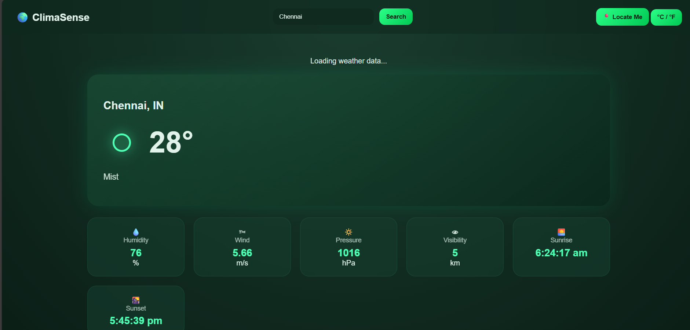

# 🌦️ ClimaSense

**ClimaSense** is a modern, API-driven weather dashboard that delivers real-time climate information with a premium dark-green glassmorphism UI.  
It allows users to search weather by city or current location and view detailed weather metrics in an intuitive dashboard.


---

## ✨ Features

- 🔍 City-based weather search
- 📍 Current location weather (Geolocation API)
- 🌡️ Real-time temperature & conditions
- 💧 Humidity, wind speed, pressure & visibility
- 🌅 Sunrise & sunset timings
- 📅 5-day weather forecast
- ⏳ Animated loading skeleton
- 🌤️ Neon SVG weather icons
- 🔄 °C / °F unit toggle
- 🗂️ Recent search history (localStorage)
- 🎨 Dark-green glassmorphism dashboard UI
- 📱 Fully responsive design

---

## 📸 Screenshots

### 🏠 Dashboard View

---

## 🛠️ Tech Stack

| Frontend        | APIs & Browser Features |
|-----------------|--------------------------|
| HTML5           | OpenWeatherMap API       |
| CSS3            | Geolocation API          |
| JavaScript (ES6)| localStorage             |
| Glassmorphism UI| Fetch API / Async-Await  |

---

## 🔑 API Used

**OpenWeatherMap API**
- Current Weather Data
- 5 Day / 3 Hour Forecast

🔗 https://openweathermap.org/api

---

## 📦 Installation & Setup

1. Clone the repository  
   ```bash
   git clone https://github.com/yourusername/ClimaSense.git
   cd ClimaSense


2. Open script.js and add your API key

js
Copy code
const apiKey = "YOUR_OPENWEATHER_API_KEY";

3. Run the project

Use VS Code Live Server (recommended)
OR

Open index.html directly in a browser

🧠 What This Project Demonstrates
API integration using Fetch & async/await

Handling real-time JSON data

Browser APIs (Geolocation & localStorage)

UI state management (loading, error, success)

Responsive dashboard-style UI design

Clean project structure and modular code

📁 Project Structure
ClimaSense/
│
├── index.html
├── style.css
├── script.js
├── about.html
└── images/
    └── screenshots
